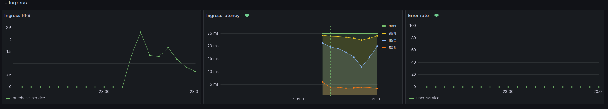
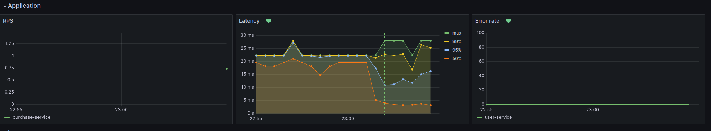
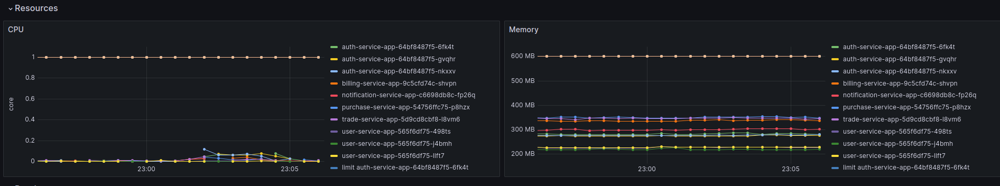
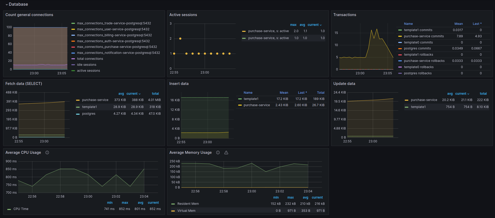
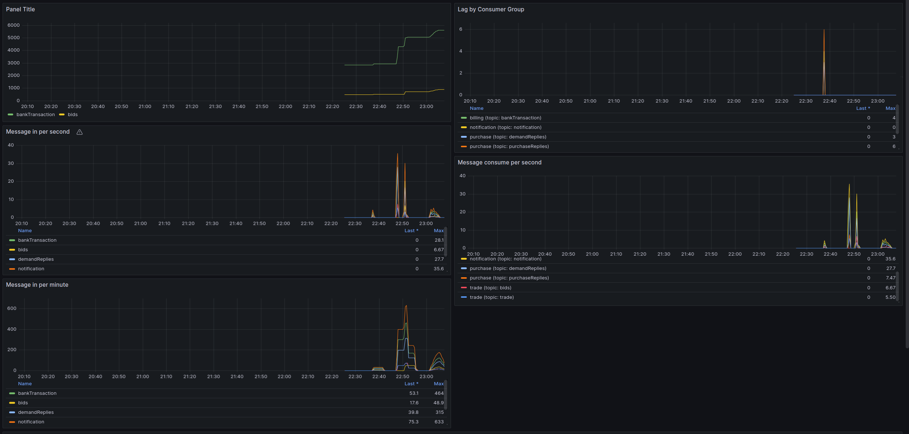

### Описание проекта

Приложение закупки.

Приложение предоставляет сервис закупок, в котором есть *Заказчики*, которые создают закупки и есть *Участники*, которые
участвуют в закупках.

1. Заказчик создает закупку
2. Участник подает заявку на закупку
3. Когда участники подают заявку, у них блокируется определенная сумма дс(10% от начальной цены закупки).
4. Когда наступает окончание подачи заявок, начинаются торги, в которых *Участники* подают ценовые предложения (для
   простоты можно указать любую сумму)
5. Когда наступает окончание торгов, закупка переходит в состояние *завершена* и определяется победитель, который
   предложил наименьшее ценовое предложение. ДС у всех участников закупки разблокируются, а у победителя снимаются.

#### Стек технологий
1. Kubernetes
2. Helm
3. Java 17
4. Spring Boot 3.2 и различные его компоненты(Security, Cloud, Jpa и т.д.)
5. Flyway
6. Kafka
7. Prometheus(Prometheus stack)
8. Grafana (Prometheus stack)

С4 схемы можно посмотреть в директории c4 model
Sequence диаграммы можно посмотреть в директории sequence diagram

### Grafana
Ingress controller  


Purchase service  


Resources  


Database  


Kafka  


### Запуск приложения

#### Запуск сервисов kafka

```shell
kubectl create namespace abdalovalex-l10-kafka && helm install kafka-service helm/kafka --namespace abdalovalex-l10-kafka
```

#### Запуск сервиса "Аутентификации"

```shell
kubectl create namespace abdalovalex-l10-auth-service && helm install auth-service helm/auth-service --namespace abdalovalex-l10-auth-service
```

#### Запуск сервиса "Пользователи"

```shell
kubectl create namespace abdalovalex-l10-user-service && helm install user-service helm/user-service --namespace abdalovalex-l10-user-service
```

#### Запуск сервиса "Закупки"

```shell
kubectl create namespace abdalovalex-l10-purchase-service && helm install purchase-service helm/purchase-service --namespace abdalovalex-l10-purchase-service
```

#### Запуск сервиса "Торги"

```shell
kubectl create namespace abdalovalex-l10-trade-service && helm install trade-service helm/trade-service --namespace abdalovalex-l10-trade-service
```

#### Запуск сервиса "Биллинг"

```shell
kubectl create namespace abdalovalex-l10-billing-service && helm install billing-service helm/billing-service --namespace abdalovalex-l10-billing-service
```

#### Запуск сервиса "Уведомления"

```shell
kubectl create namespace abdalovalex-l10-notification-service && helm install notification-service helm/notification-service --namespace abdalovalex-l10-notification-service
```

### Запуск тестов
```shell
newman run ./tests/tests.json
```

### Удаление

#### Kafka

```shell
helm uninstall kafka -n abdalovalex-l10-kafka  
kubectl delete namespace abdalovalex-l10-kafka 
````

#### Удалить сервис "Аутентификации"

```shell
helm uninstall auth-service -n abdalovalex-l10-auth-service  
kubectl delete namespace abdalovalex-l10-auth-service
kubectl delete clusterrolebinding auth-service
kubectl delete clusterrole auth-service 
````

#### Удалить сервис "Пользователи"

```shell
helm uninstall user-service -n abdalovalex-l10-user-service  
kubectl delete namespace abdalovalex-l10-user-service
kubectl delete clusterrolebinding user-service
kubectl delete clusterrole user-service
````

#### Удалить сервис "Закупки"

```shell
helm uninstall purchase-service -n abdalovalex-l10-purchase-service  
kubectl delete namespace abdalovalex-l10-purchase-service
kubectl delete clusterrolebinding purchase-service
kubectl delete clusterrole purchase-service 
````

#### Удалить сервис "Торги"

```shell
helm uninstall order-service -n abdalovalex-l10-trade-service  
kubectl delete namespace abdalovalex-l10-trade-service
kubectl delete clusterrolebinding trade-service
kubectl delete clusterrole trade-service 
````

#### Удалить сервис "Биллинг"

```shell
helm uninstall billing-service -n abdalovalex-l10-billing-service  
kubectl delete namespace abdalovalex-l10-billing-service
kubectl delete clusterrolebinding billing-service
kubectl delete clusterrole billing-service 
````

#### Удалить сервис "Уведомления"

```shell
helm uninstall notification-service -n abdalovalex-l10-notification-service  
kubectl delete namespace abdalovalex-l10-notification-service
kubectl delete clusterrolebinding notification-service
kubectl delete clusterrole notification-service 
```